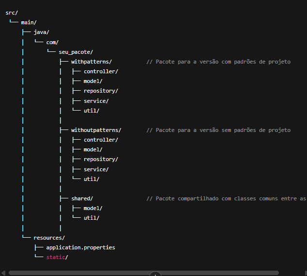

Estrutura do Projeto

Explicação da Estrutura

withpatterns/:
Este pacote contém toda a implementação da versão com os padrões de projeto. Dentro dele, você pode ter as mesmas subestruturas que teria normalmente em um projeto Spring Boot, como controller, model, repository, service e util.

Exemplo:

Controller: Controladores REST para gerenciar as requisições HTTP, onde você pode utilizar os padrões como Observer ou Strategy.

Service: Lógica de negócios, onde você aplica os padrões como Singleton, Repository, Strategy, etc.

Repository: A camada de persistência de dados com o uso do padrão Repository.

Util: Qualquer classe auxiliar ou padrão de utilidade como o Singleton ou outros.

withoutpatterns/:
Este pacote contém a versão sem os padrões de projeto. A estrutura será similar à da versão com padrões, mas sem a introdução dos padrões. O objetivo aqui é implementar uma solução mais simples e direta para o sistema, de forma a facilitar a comparação.

shared/:
Caso existam classes comuns entre as duas versões (como o modelo de User, ou algumas configurações do banco de dados), elas podem ser colocadas em um pacote compartilhado. Esse pacote serve para manter o código reutilizável entre as versões, evitando a duplicação de classes comuns a ambas.

